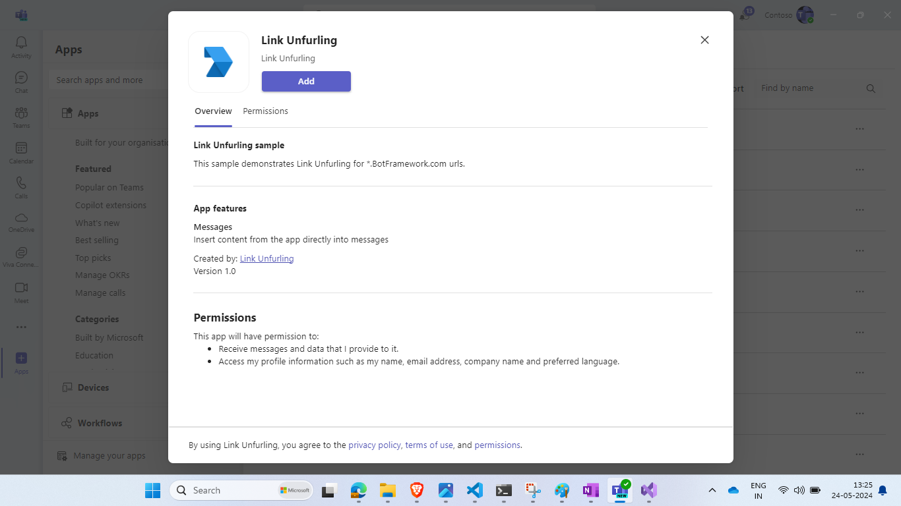
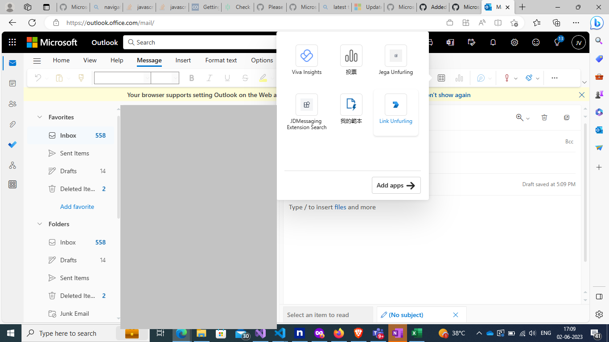
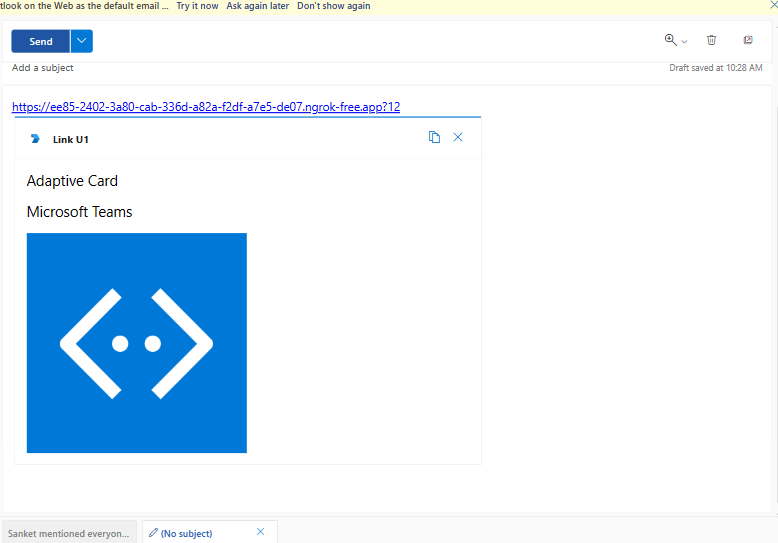

# Teams Link Unfurl Copilot Bot C#

Copilot Bot Teams [link unfurling](https://docs.microsoft.com/microsoftteams/platform/messaging-extensions/how-to/link-unfurling?tabs=json) bot sample for Teams.
This sample showcases a [Copilot SDK](https://dev.microsoftcopilot.com) that utilizes link unfurling in Microsoft Teams, enhancing the user experience within Messaging Extensions. It includes features such as search commands and interaction with adaptive cards to provide rich content previews and user engagement.


## Included Features
* Bots
* Copilot Bot
* Message Extensions
* Search Commands
* Link Unfurling

## Interaction with Messaging Extension Link Unfurling


## Prerequisites

- Microsoft Teams is installed and you have an account
- [.NET SDK](https://dotnet.microsoft.com/download) version 6.0
- [dev tunnel](https://learn.microsoft.com/en-us/azure/developer/dev-tunnels/get-started?tabs=windows)

## Setup

> Note these instructions are for running the sample on your local machine, the tunnelling solution is required because
the Teams service needs to call into the bot.

1) Clone the repository

    ```bash
   git clone https://dynamicscrm@dev.azure.com/dynamicscrm/OneCRM/_git/Microsoft.Agents.Sdk
    ```

1) Setup for Bot

 -  Register a Microsoft Entra ID aap registration in Azure portal [Microsoft Entra ID – App Registrations](https://go.microsoft.com/fwlink/?   linkid=2083908).

  - In Azure portal, create a [Azure Bot resource](https://docs.microsoft.com/azure/bot-service/bot-service-quickstart-registration).
    - For bot handle, make up a name.
    - Select "Use existing app registration" (Create the app registration in Microsoft Entra ID beforehand.)
    - __*If you don't have an Azure account*__ create an [Azure free account here](https://azure.microsoft.com/free/)
    
   In the new Azure Bot resource in the Portal, 
    - Ensure that you've [enabled the Teams Channel](https://learn.microsoft.com/azure/bot-service/channel-connect-teams?view=azure-bot-service-4.0)
    - Ensure that you've [enabled the Outlook Channel](https://learn.microsoft.com/en-us/azure/bot-service/bot-service-channel-connect-actionable-email?view=azure-bot-service-4.0)
    - In Settings/Configuration/Messaging endpoint, enter the current `https` URL you were given by running the tunnelling application. Append with the path `/api/messages`

1) If you are using Visual Studio
   - Launch Visual Studio
   - File -> Open -> Project/Solution.
   - Select `Microsoft.CopilotStudio.SDK.sln` file and open it in Visual Studio
   - Navigate to `samples/teams/msgext-link-unfurling` folder
   - Select `LinkUnfurling.csproj`
   - Set As Startup Project and Press `F5` to run this project.

1) Run the `dev tunnels`. Please follow [Create and host a dev tunnel](https://learn.microsoft.com/en-us/azure/developer/dev-tunnels/get-started?tabs=windows) and host the tunnel with anonymous user access command as shown below:
   > NOTE: Go to your project directory and open the `./Properties/launchSettings.json` file. Check the port number and update it to match your DevTunnel port. If `./Properties/launchSettings.json`not fount Close and re-open the solution.launchSettings.json have been re-created.

   ```bash
   devtunnel host -p 3978 --allow-anonymous
   ```

#### Configuring authentication in the Link Unfurling Sample Project

To configure authentication into the Link Unfurling Sample Project you will need the following information:

1. Client ID of the Application identity you wish to use.
1. Client Secret of the Application identity you wish to use or the Certificate that has been registered for the Client ID in Entra AD

Once you have that information, to configure authentication, Open the `appsettings.json` file in the root of the sample project.

Find the section labeled `Connections`,  it should appear similar to this:

```json
"Connections": {
  "BotServiceConnection": {
    "Assembly": "Microsoft.Agents.Authentication.Msal",
    "Type":  "MsalAuth",
    "Settings": {
      "AuthType": "ClientSecret", // this is the AuthType for the connection, valid values can be found in Microsoft.Agents.Authentication.Msal.Model.AuthTypes.  The default is ClientSecret.
      "AuthorityEndpoint": "https://login.microsoftonline.com/botframework.com",
      "ClientId": "00000000-0000-0000-0000-000000000000", // this is the Client ID used for the connection.
      "ClientSecret": "00000000-0000-0000-0000-000000000000", // this is the Client Secret used for the connection.
      "Scopes": [
        "https://api.botframework.com/.default"
      ],
      "TenantId": "" // This is the Tenant ID used for the Connection. 
    }
  }
```

1. Set the **AuthType** to either `ClientSecret` or `Certificate`
1. Set the **ClientId** to the Client Id of your identity
1. if you chose `ClientSecret`
    1. Set the ClientSecret to the Secret that was created for your identity.
1. if you chose `Certificate`
    1. Import the PFX Certificate to your local machine and note which certificate store it was loaded into.
    1. Replace the key **ClientSecret** with **CertificateThumbPrint** and set the value of the **CertificateThumbPrint** to the thumbprint of your certificate
1. Set the **TenantId** to the Tenant Id where your application is registered.

1) Run your bot, either from Visual Studio with `F5` or using `dotnet run` in the appropriate folder.

1) __*This step is specific to Teams.*__
    - **Edit** the `manifest.json` contained in the  `AppManifest` folder to replace your Microsoft App Id (that was created when you registered your bot earlier) *everywhere* you see the place holder string `<<YOUR-MICROSOFT-APP-ID>>` (depending on the scenario the Microsoft App Id may occur multiple times in the `manifest.json`)
    - **Zip** up the contents of the `AppManifest` folder to create a `manifest.zip` (Make sure that zip file does not contains any subfolder otherwise you will get error while uploading your .zip package)
    - **Upload** the `manifest.zip` to Teams (In Teams Apps/Manage your apps click "Upload an app". Browse to and Open the .zip file. At the next dialog, click the Add button.)


## Running the sample



> Note the Teams `manifest.json` for this sample also includes a Search Query. This Messaging Extension is only introduced in order to enable installation, because there is no mechanism for installing a link unfurling feature in isolation.

If you copy and paste the link `https://teamstestdomain.com/teams/csharp`, it wil unfurl inside compose area.

- Note : To enable link unfurling for your domain, add your domain to the manifest.json file under message handlers.


## Outlook on the web

- To view your app in Outlook on the web.

- Go to [Outlook on the web](https://outlook.office.com/mail/)and sign in using your dev tenant account.

**After opening Outlook web, click the "New mail" button.**


**on the tool bar on top,select Apps icon. Your sideloaded app title appears among your installed apps**



**Select your app icon to launch your app in Office on the web**



## Deploy the bot to Azure

To learn more about deploying a bot to Azure, see [Deploy your bot to Azure](https://aka.ms/azuredeployment) for a complete list of deployment instructions.

## Further reading

- [Link unfurling](https://learn.microsoft.com/microsoftteams/platform/messaging-extensions/how-to/link-unfurling?tabs=dotnet%2Cadvantages)
- [Copilot SDK](https://dev.microsoftcopilot.com)
- [Bot Basics](https://docs.microsoft.com/azure/bot-service/bot-builder-basics?view=azure-bot-service-4.0)
- [Azure Bot Service Introduction](https://docs.microsoft.com/azure/bot-service/bot-service-overview-introduction?view=azure-bot-service-4.0)
- [Azure Bot Service Documentation](https://docs.microsoft.com/azure/bot-service/?view=azure-bot-service-4.0)