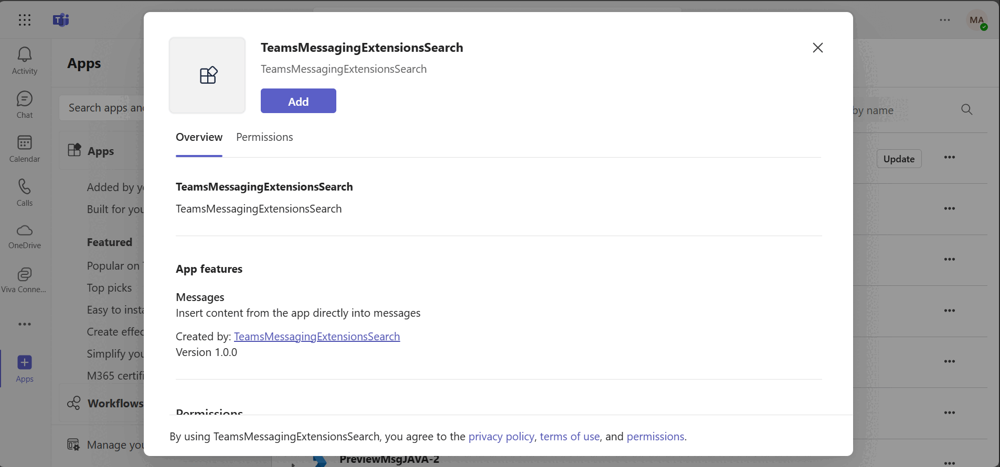

# Messaging Extensions Search

[Messaging Extensions](https://docs.microsoft.com/microsoftteams/platform/messaging-extensions/what-are-messaging-extensions) are a special kind of Microsoft Teams application that is support by the [Copilot SDK](https://dev.microsoftcopilot.com).

This sample has been created using [Copilot SDK](https://dev.microsoftcopilot.com).

This sample illustrates how to create a [Search-based](https://docs.microsoft.com/microsoftteams/platform/messaging-extensions/how-to/search-commands/define-search-command) messaging extension in Microsoft Teams using the Copilot SDK. It enables users to search for and select items via the command bar, supporting various interactions such as querying data and selecting results for further actions.

## Included Features
* Copilot Bots
* Message Extensions
* Search Commands

## Interaction with Messaging Extension


## Prerequisites

- Microsoft Teams is installed and you have an account
- [.NET SDK](https://dotnet.microsoft.com/download) version 6.0
- [dev tunnel](https://learn.microsoft.com/en-us/azure/developer/dev-tunnels/get-started?tabs=windows)

## Running manually

> Note these instructions are for running the sample on your local machine, the tunnelling solution is required because
the Teams service needs to call into the bot.

1) Use `dev tunnels` to allow messages sent to the Azure Bot to reach your local bot. Please follow [Create and host a dev tunnel](https://learn.microsoft.com/en-us/azure/developer/dev-tunnels/get-started?tabs=windows) and host the tunnel with anonymous user access command as shown below:

   ```bash
   devtunnel host -p 3978 --allow-anonymous
   ```

1) Setup for Bot

   In Azure portal, create a [Azure Bot resource](https://docs.microsoft.com/azure/bot-service/bot-service-quickstart-registration).
    - For bot handle, make up a name.
    - Select "Use existing app registration" (Create the app registration in Microsoft Entra ID beforehand.)
    - __*If you don't have an Azure account*__ create an [Azure free account here](https://azure.microsoft.com/free/)
    
   In the new Azure Bot resource in the Portal, 
    - Ensure that you've [enabled the Teams Channel](https://learn.microsoft.com/azure/bot-service/channel-connect-teams?view=azure-bot-service-4.0)
    - In Settings/Configuration/Messaging endpoint, enter the current `https` URL you were given by running the tunnelling application. Append with the path `/api/messages`

1) Clone the repository

    ```bash
    git clone https://dynamicscrm@dev.azure.com/dynamicscrm/OneCRM/_git/Microsoft.Copilot.Sdk
    ```

1) If you are using Visual Studio
   - Launch Visual Studio
   - File -> Open -> Project/Solution.
   - Select `Microsoft.CopilotStudio.SDK.sln` file and open it in Visual Studio
   - Navigate to `samples/teams/msgext-search` folder
   - Select `MessagingExtensionsSearch.csproj`
   - Set As Startup Project

#### Configuring authentication in the Messaging Extension Search Sample Project

To configure authentication into the Messaging Extension Search Sample Project you will need the following information:

1. Client ID of the Application identity you wish to use.
1. Client Secret of the Application identity you wish to use or the Certificate that has been registered for the Client ID in Entra AD

Once you have that information, to configure authentication, Open the `appsettings.json` file in the root of the sample project.

Find the section labeled `Connections`,  it should appear similar to this:

```json
"BaseUrl": "{{BaseUrl}}",
"Connections": {
  "BotServiceConnection": {
    "Assembly": "Microsoft.Agents.Authentication.Msal",
    "Type":  "MsalAuth",
    "Settings": {
      "AuthType": "ClientSecret", // this is the AuthType for the connection, valid values can be found in Microsoft.Agents.Authentication.Msal.Model.AuthTypes.  The default is ClientSecret.
      "AuthorityEndpoint": "https://login.microsoftonline.com/botframework.com",
      "ClientId": "00000000-0000-0000-0000-000000000000", // this is the Client ID used for the connection.
      "ClientSecret": "00000000-0000-0000-0000-000000000000", // this is the Client Secret used for the connection.
      "Scopes": [
        "https://api.botframework.com/.default"
      ],
      "TenantId": "" // This is the Tenant ID used for the Connection. 
    }
  }
```

1. Set the **AuthType** to either `ClientSecret` or `Certificate`
1. Set the **ClientId** to the Client Id of your identity
1. if you chose `ClientSecret`
    1. Set the ClientSecret to the Secret that was created for your identity.
1. if you chose `Certificate`
    1. Import the PFX Certificate to your local machine and note which certificate store it was loaded into.
    1. Replace the key **ClientSecret** with **CertificateThumbPrint** and set the value of the **CertificateThumbPrint** to the thumbprint of your certificate
1. Set the **TenantId** to the Tenant Id where your application is registered.
1. Set `{{BaseUrl}}` in the `appsettings.json` as per your application using dev tunnels, your URL will be like: https://12345.devtunnels.ms.

1) Run your bot, either from Visual Studio with `F5` or using `dotnet run` in the appropriate folder.

1) __*This step is specific to Teams.*__
    - **Edit** the `manifest.json` contained in the  `teamsAppManifest` folder to replace your Microsoft App Id(Client ID) (that was created when you registered your bot earlier) *everywhere* you see the place holder string `<<YOUR-MICROSOFT-APP-ID>>` (depending on the scenario the Microsoft App Id may occur multiple times in the `manifest.json`)
    - **Edit** the `manifest.json` for `validDomains` with base Url domain. E.g. if you are using dev tunnels then your domain will be like: `12345.devtunnels.ms`.
    - **Zip** up the contents of the `teamsAppManifest` folder to create a `manifest.zip`
    - **Upload** the `manifest.zip` to Teams (In Teams Apps/Manage your apps click "Upload an app". Browse to and Open the .zip file. At the next dialog, click the Add button.)

**Note**: If you are facing any issue in your app, please uncomment [this](https://github.com/OfficeDev/Microsoft-Teams-Samples/blob/main/samples/msgext-search/csharp/AdapterWithErrorHandler.cs#L25) line and put your debugger for local debug.

## Running the sample

> Note this `manifest.json` specified that the feature will be available from both the `compose` and `commandBox` areas of Teams. Please refer to Teams documentation for more details.

In Teams, the command bar is located at the top of the window. When you at mention the bot what you type is forwarded (as you type) to the bot for processing. By way of illustration, this sample uses the text it receives to query the NuGet package store.

**Mention In Search CommandBar:**
  

**Search Result:**
  

**Selected Item:**
  

There is a secondary, drill down, event illustrated in this sample: clicking on the results from the initial query will result in the bot receiving another event.


## Deploy the bot to Azure

To learn more about deploying a bot to Azure, see [Deploy your bot to Azure](https://aka.ms/azuredeployment) for a complete list of deployment instructions.

## Further reading

- [Search based messaging extension](https://learn.microsoft.com/microsoftteams/platform/messaging-extensions/how-to/search-commands/define-search-command)
- [Copilot SDK](https://dev.microsoftcopilot.com)
- [Bot Basics](https://docs.microsoft.com/azure/bot-service/bot-builder-basics?view=azure-bot-service-4.0)
- [Azure Bot Service Introduction](https://docs.microsoft.com/azure/bot-service/bot-service-overview-introduction?view=azure-bot-service-4.0)
- [Azure Bot Service Documentation](https://docs.microsoft.com/azure/bot-service/?view=azure-bot-service-4.0)

