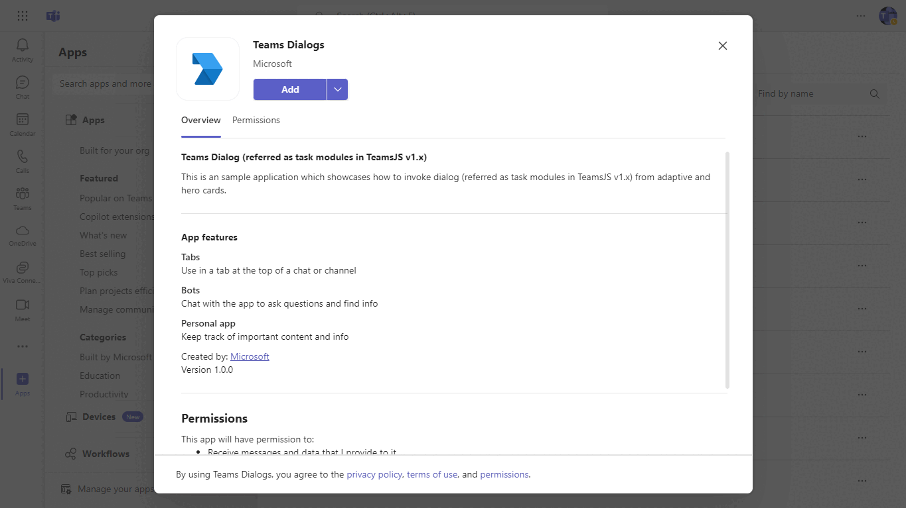
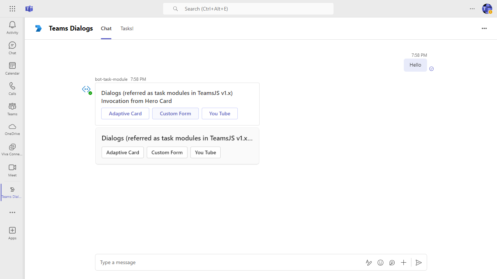
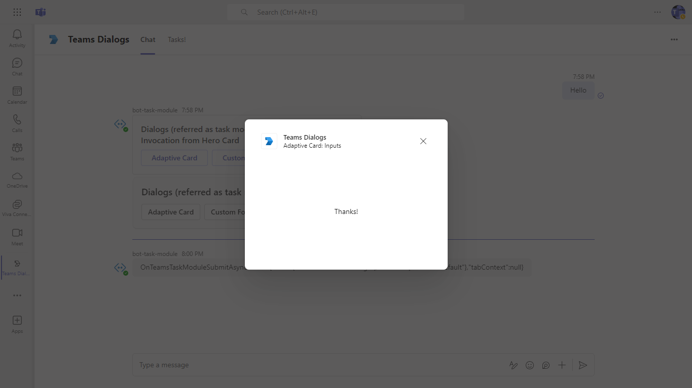
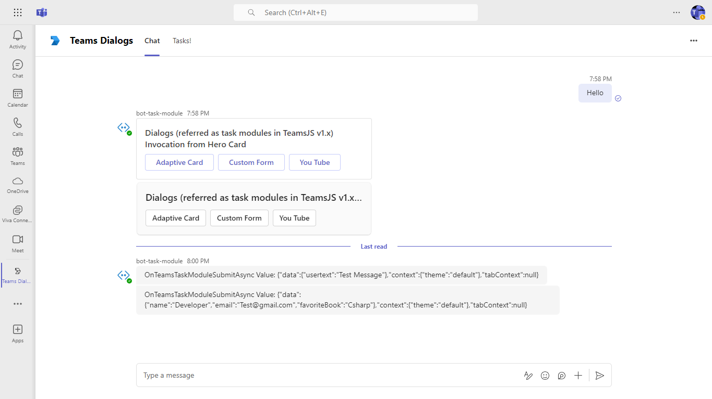
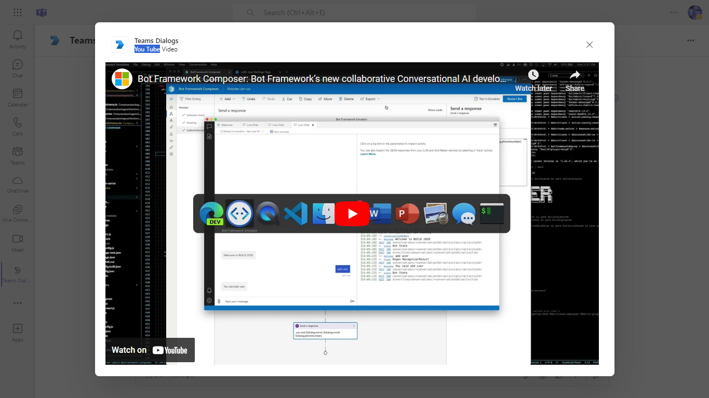
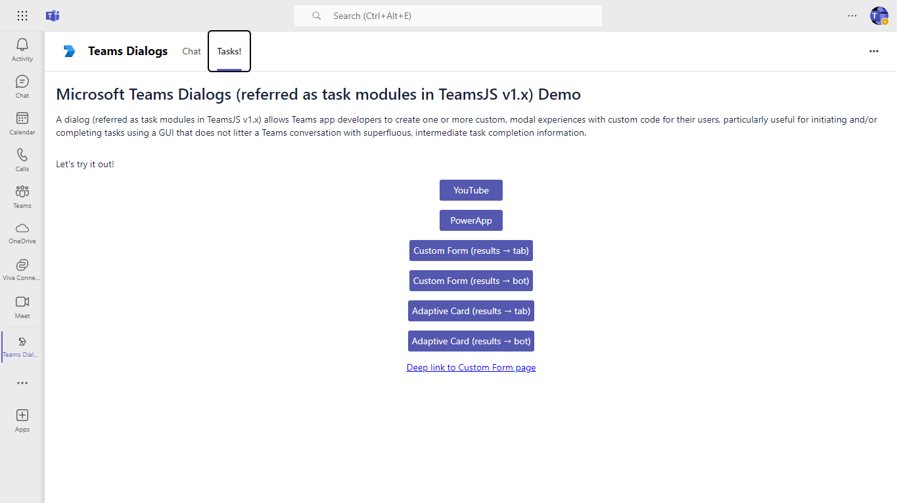
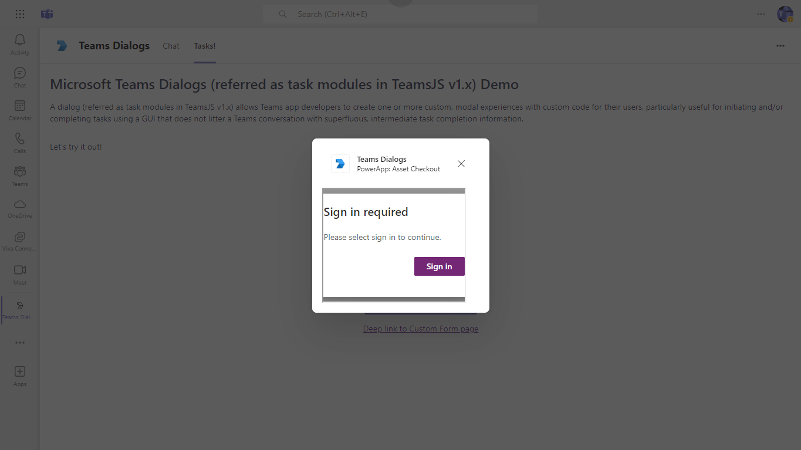
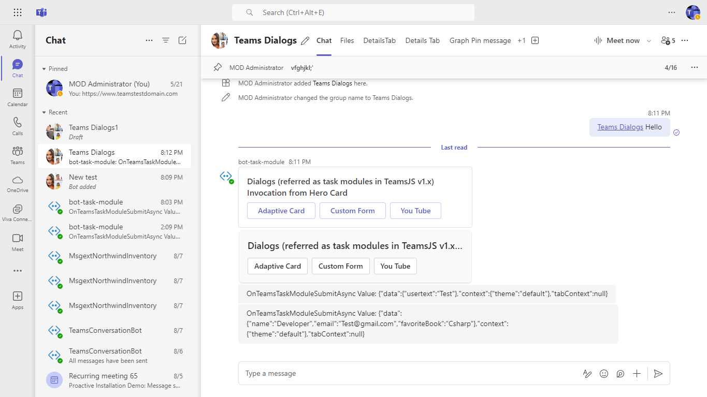

# Teams Dialog (referred as task modules in TeamsJS v1.x)

Copilot SDK Teams Dialogs (referred as task modules in TeamsJS v1.x) sample.

This sample has been created using [Copilot SDK](https://dev.microsoftcopilot.com). It shows how to fetch a Dialog (referred as task modules in TeamsJS v1.x) from Hero Card or Adaptive Card buttons and receive input from the Dialog (referred as task modules in TeamsJS v1.x) in the bot.

## Included Features
* Copilot Bot
* Tabs
* Dialogs (referred as task modules in TeamsJS v1.x)

## Interaction with Copilot-Bot


## Try it yourself - experience the App in your Microsoft Teams client
Please find below demo manifest which is deployed on Microsoft Azure and you can try it yourself by uploading the app manifest (.zip file link below) to your teams and/or as a personal app. (Sideloading must be enabled for your tenant, [see steps here](https://docs.microsoft.com/microsoftteams/platform/concepts/build-and-test/prepare-your-o365-tenant#enable-custom-teams-apps-and-turn-on-custom-app-uploading)).

## Prerequisites

- Microsoft Teams is installed and you have an account
- [.NET SDK](https://dotnet.microsoft.com/download) version 6.0
- [dev tunnel](https://learn.microsoft.com/en-us/azure/developer/dev-tunnels/get-started?tabs=windows)
- [Teams Toolkit for Visual Studio](https://learn.microsoft.com/en-us/microsoftteams/platform/toolkit/toolkit-v4/install-teams-toolkit-vs?pivots=visual-studio-v17-7)

## Setup

> Note these instructions are for running the sample on your local machine, the tunnelling solution is required because
the Teams service needs to call into the copilot bot.

1) Run `dev tunnels`

1.  Please follow [Create and host a dev tunnel](https://learn.microsoft.com/en-us/azure/developer/dev-tunnels/get-started?tabs=windows) and host the tunnel with anonymous user access command as shown below:

   ```bash
   devtunnel host -p 3978 --allow-anonymous
   ```

1) Setup for Bot

   In Azure portal, create a [Azure Bot resource](https://docs.microsoft.com/azure/bot-service/bot-service-quickstart-registration).
    - For bot handle, make up a name.
    - Select "Use existing app registration" (Create the app registration in Microsoft Entra ID beforehand.)
    - __*If you don't have an Azure account*__ create an [Azure free account here](https://azure.microsoft.com/free/)
    
   In the new Azure Bot resource in the Portal, 
    - Ensure that you've [enabled the Teams Channel](https://learn.microsoft.com/azure/bot-service/channel-connect-teams?view=azure-bot-service-4.0)
    - In Settings/Configuration/Messaging endpoint, enter the current `https` URL you were given by running the tunneling application. Append with the path `/api/messages`

1) Clone the repository

    ```bash
    git clone https://github.com/OfficeDev/Microsoft-Teams-Samples.git
    ```

1) If you are using Visual Studio
   - Launch Visual Studio
   - File -> Open -> Project/Solution
   - Navigate to `samples/teams/teams-task-module` folder
   - Select `TeamsTaskModule.csproj`file

#### Configuring authentication in the TaskModule Sample Project

To configure authentication into the Task Module Sample Project you will need the following information:

1. Client ID of the Application identity you wish to use.
1. Client Secret of the Application identity you wish to use or the Certificate that has been registered for the Client ID in Entra AD

Once you have that information, to configure authentication, Open the `appsettings.json` file in the root of the sample project.

Find the section labeled `Connections`,  it should appear similar to this:

```json
"BaseUrl": "{{BaseUrl}}",
"Connections": {
  "BotServiceConnection": {
    "Assembly": "Microsoft.Agents.Authentication.Msal",
    "Type":  "MsalAuth",
    "Settings": {
      "AuthType": "ClientSecret", // this is the AuthType for the connection, valid values can be found in Microsoft.Agents.Authentication.Msal.Model.AuthTypes.  The default is ClientSecret.
      "AuthorityEndpoint": "https://login.microsoftonline.com/botframework.com",
      "ClientId": "00000000-0000-0000-0000-000000000000", // this is the Client ID used for the connection.
      "ClientSecret": "00000000-0000-0000-0000-000000000000", // this is the Client Secret used for the connection.
      "Scopes": [
        "https://api.botframework.com/.default"
      ],
      "TenantId": "" // This is the Tenant ID used for the Connection. 
    }
  }
```

1. Set the **AuthType** to either `ClientSecret` or `Certificate`
1. Set the **ClientId** to the Client Id of your identity
1. if you chose `ClientSecret`
    1. Set the ClientSecret to the Secret that was created for your identity.
1. if you chose `Certificate`
    1. Import the PFX Certificate to your local machine and note which certificate store it was loaded into.
    1. Replace the key **ClientSecret** with **CertificateThumbPrint** and set the value of the **CertificateThumbPrint** to the thumbprint of your certificate
1. Set the **TenantId** to the Tenant Id where your application is registered.
1. Set `{{BaseUrl}}` in the `appsettings.json` as per your application using dev tunnels, your URL will be like: https://12345.devtunnels.ms.
 
1) Run your copilot bot, either from Visual Studio with `F5` or using `dotnet run` in the appropriate folder.

1) __*This step is specific to Teams.*__
    - **Edit** the `manifest.json` contained in the `appPackage` folder to replace your Microsoft App Id (that was created when you registered your bot earlier) *everywhere* you see the place holder string `<<YOUR-MICROSOFT-APP-ID>>` (depending on the scenario the Microsoft App Id may occur multiple times in the `manifest.json`)
    - **Edit** the `manifest.json` for `<<Domain-Name>>` with base Url domain. E.g with dev tunnels then your domain will be like: `12345.devtunnels.ms`.
    - **Zip** up the contents of the `appPackage` folder to create a `manifest.zip` (Make sure that zip file does not contains any subfolder otherwise you will get error while uploading your .zip package)
    - **Upload** the `manifest.zip` to Teams (In Teams Apps/Manage your apps click "Upload an app". Browse to and Open the .zip file. At the next dialog, click the Add button.)
    - Add the app in personal/groupchat/team scope (supported scopes)

**Note**: If you are facing any issue in your app, please uncomment [this](https://github.com/OfficeDev/Microsoft-Teams-Samples/blob/main/samples/bot-task-module/csharp/AdapterWithErrorHandler.cs#L24) line and put your debugger for local debug.

## Running the sample

> Note this `manifest.json` specified that the bot will be installed in "personal", "team" and "groupchat" scope which is why you immediately entered a one on one chat conversation with the bot. You can at mention the bot in a group chat or in a Channel in the Team you installed it in. Please refer to Teams documentation for more details.

You can interact with this bot by sending it a message. The bot will respond with a Hero Card and Adaptive Card with buttons which will display a Dialog (referred as task modules in TeamsJS v1.x) when clicked. The Dialogs (referred as task modules in TeamsJS v1.x) demonstrate retrieving input from a user, or displaying custom web page content.

- **Personal Scope Interactions:**



















## Deploy the bot to Azure

To learn more about deploying a bot to Azure, see [Deploy your bot to Azure](https://aka.ms/azuredeployment) for a complete list of deployment instructions.

## Further reading

- [Copilot SDK](https://dev.microsoftcopilot.com)
- [Bot Basics](https://docs.microsoft.com/azure/bot-service/bot-builder-basics?view=azure-bot-service-4.0)
- [Azure Bot Service Introduction](https://docs.microsoft.com/azure/bot-service/bot-service-overview-introduction?view=azure-bot-service-4.0)
- [Azure Bot Service Documentation](https://docs.microsoft.com/azure/bot-service/?view=azure-bot-service-4.0)
- [Dialogs](https://learn.microsoft.com/en-us/microsoftteams/platform/task-modules-and-cards/what-are-task-modules)

