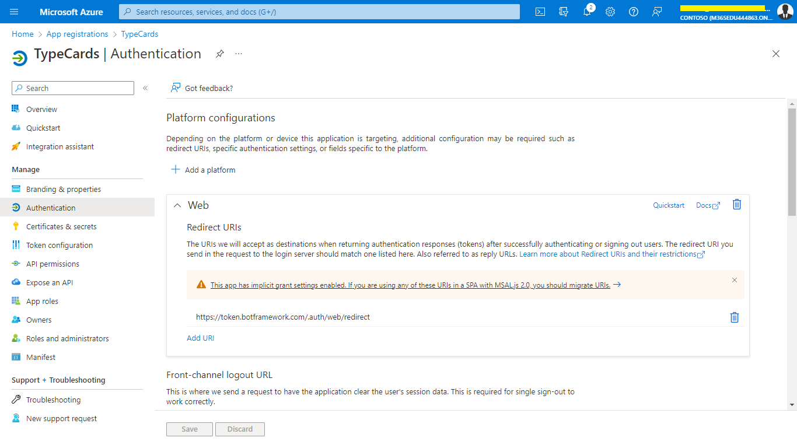
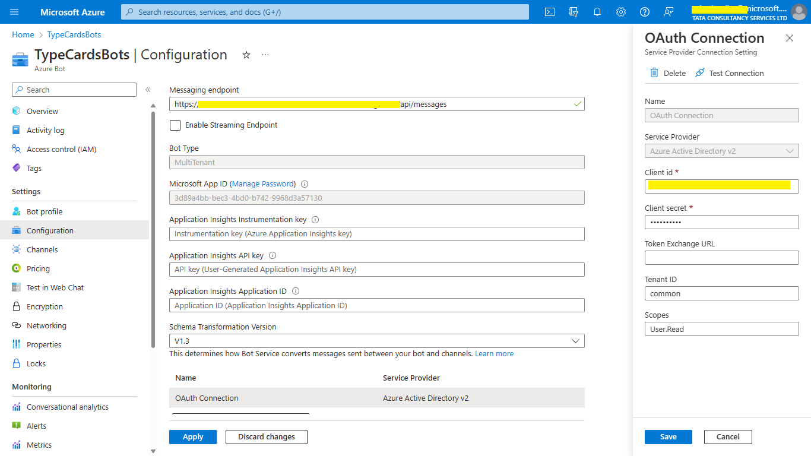
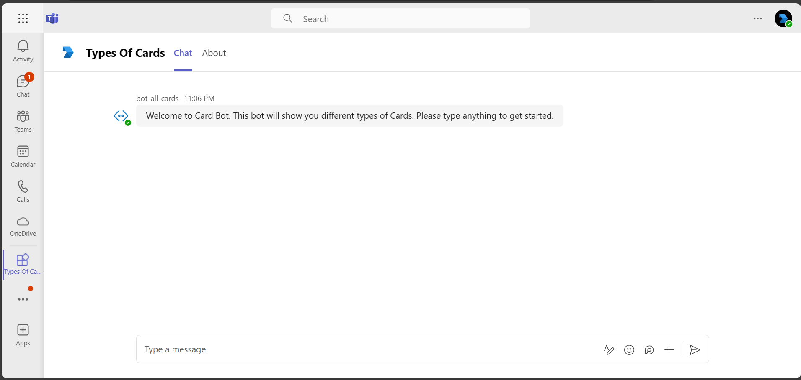
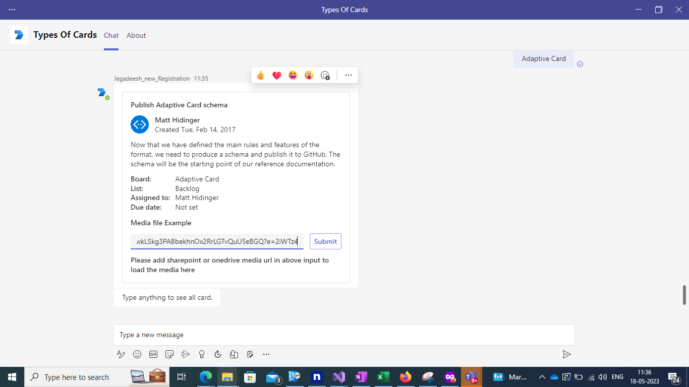
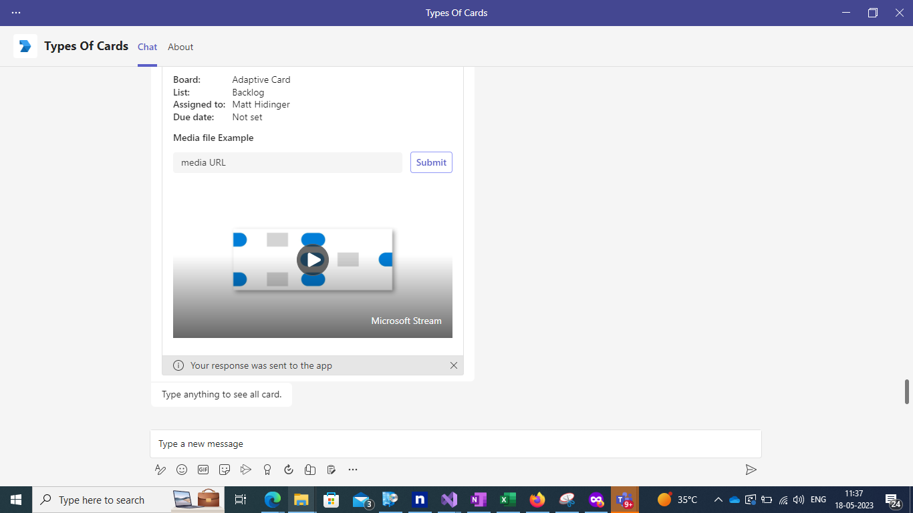
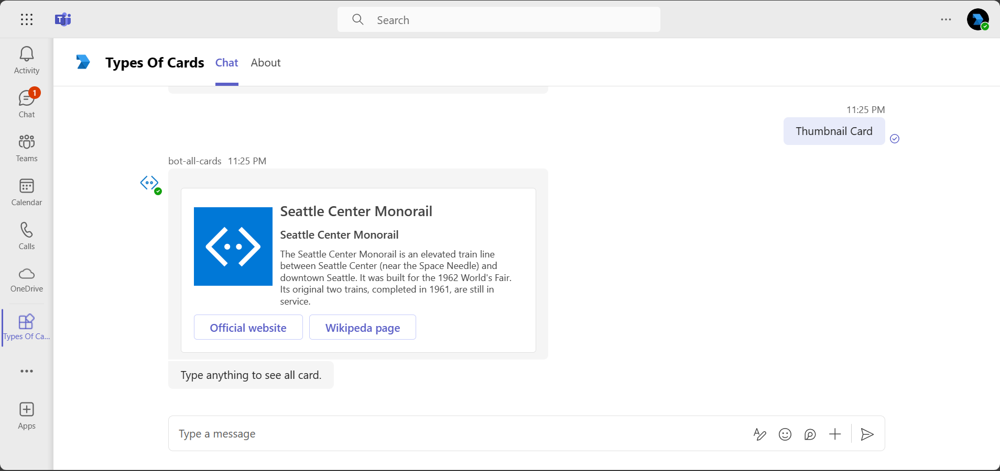
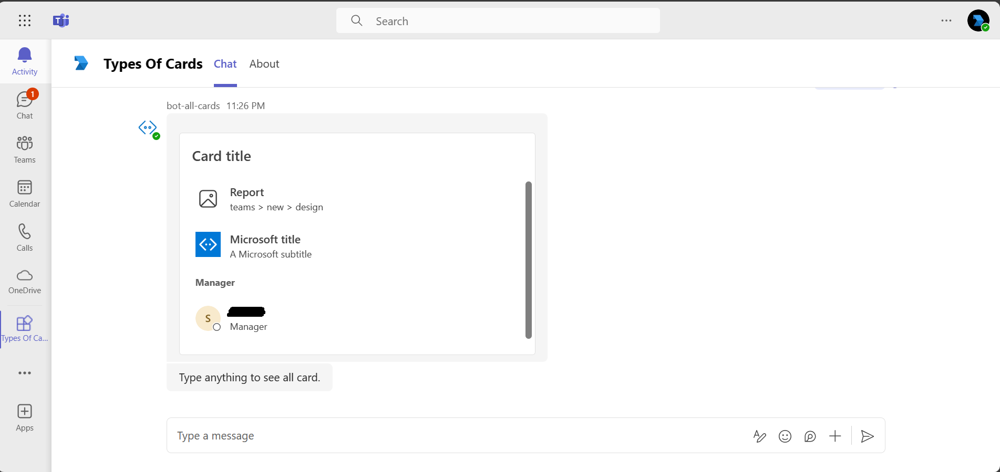
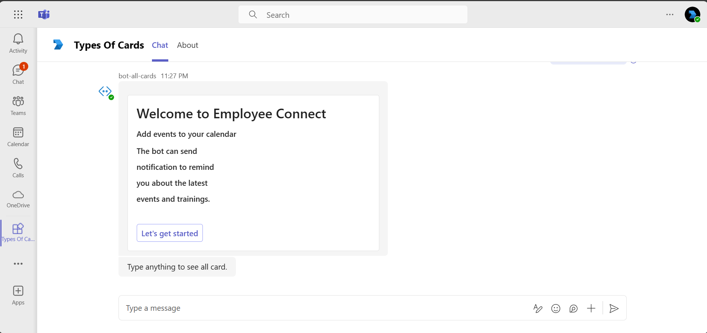
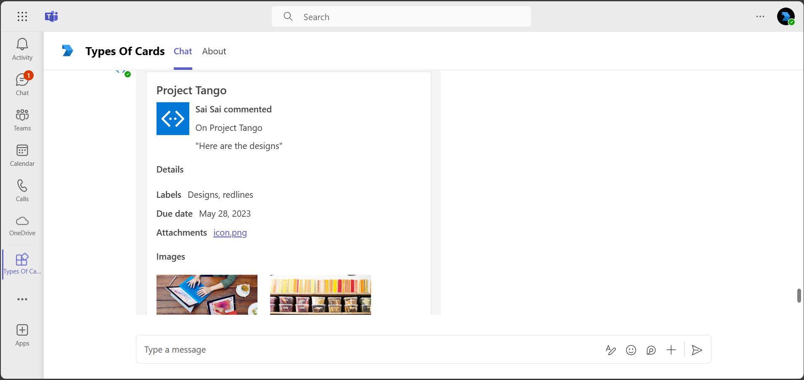

# Types of Cards

This bot has been created using [Copilot Studio SDK](https://github.com/microsoft/copilot-sdk).
This sample shows the feature where user can send different types of cards using bot.

## Prerequisites

- Microsoft Teams is installed and you have an account
- [.NET Core SDK](https://dotnet.microsoft.com/download) version 6.0

  determine dotnet version
  ```bash
  dotnet --version
  ```
- [dev tunnel](https://learn.microsoft.com/en-us/azure/developer/dev-tunnels/get-started?tabs=windows)

```bash
 devtunnel host -p 3978 --allow-anonymous
```

## Interaction with app


## Setup

 - Register a new application in the [Microsoft Entra ID – App Registrations](https://go.microsoft.com/fwlink/?linkid=2083908) portal.

    1) Select **New Registration** and on the *register an application page*, set following values:
        * Set **name** to your app name.
        * Choose the **supported account types** (any account type will work)
        * Leave **Redirect URI** empty.
        * Choose **Register**.
    2) On the overview page, copy and save the **Application (client) ID, Directory (tenant) ID**. You’ll need those later when updating your Teams application manifest and in the appsettings.json.
    3) Navigate to **Authentication**
        If an app hasn't been granted IT admin consent, users will have to provide consent the first time they use an app.
        
        - Set another redirect URI:
        * Select **Add a platform**.
        * Select **web**.
        * Enter the **redirect URI** for the app in the following format: 
          1) https://token.botframework.com/.auth/web/redirect

    
        
    4) Navigate to the **Certificates & secrets**. In the Client secrets section, click on "+ New client secret". Add a description (Name of the secret) for the secret and select “Never” for Expires. Click "Add". Once the client secret is created, copy its value, it need to be placed in the appsettings.json.

2. Setup for Bot
- In Azure portal, create a [Azure Bot resource](https://docs.microsoft.com/en-us/azure/bot-service/bot-builder-authentication?view=azure-bot-service-4.0&tabs=csharp%2Caadv2).
- Ensure that you've [enabled the Teams Channel](https://docs.microsoft.com/en-us/azure/bot-service/channel-connect-teams?view=azure-bot-service-4.0)
- While registering the bot, use `https://<your_tunnel_domain>/api/messages` as the messaging endpoint.

3. Setup Dev Tunnel 

1) Run the `dev tunnels`. Please follow [Create and host a dev tunnel](https://learn.microsoft.com/en-us/azure/developer/dev-tunnels/get-started?tabs=windows) and host the tunnel with anonymous user access command as shown below:
   > NOTE: Go to your project directory and open the `./Properties/launchSettings.json` file. Check the port number and update it to match your DevTunnel port. If `./Properties/launchSettings.json`not fount Close and re-open the solution.launchSettings.json have been re-created.
 
   ```bash
   devtunnel host -p 3978 --allow-anonymous
   ```

4. Setup for code 
- Clone the repository

    ```bash
    git clone https://dynamicscrm@dev.azure.com/dynamicscrm/OneCRM/_git/Microsoft.Agents.Sdk
    ```

 - If you are using Visual Studio

 - Launch Visual Studio
 - File -> Open Folder
  - Select `Microsoft.CopilotStudio.SDK.sln` file and open it in Visual Studio
  - Navigate to `samples/teams/bot-all-cards` folder
  - Select `BotAllCards.csproj`.
  - Set As Startup Project  

- **This step is specific to Teams.**

1) Modify the `manifest.json` in the `/TeamsAppManifest` folder and replace the following details:
  - `{{Microsoft-App-Id}}` with Application id generated from Step 1
  - `{{domain-name}}` with base Url domain. E.g. if you are using dev tunnel it would be `12345.devtunnels.ms`.

2) Zip the contents of `TeamsAppManifest` folder into a `manifest.zip`.

#### Configuring authentication in the Bot All Cards Sample Project

To configure authentication into the Bot All Cards Sample Project you will need the following information:

1. Client ID of the Application identity you wish to use.
1. Client Secret of the Application identity you wish to use or the Certificate that has been registered for the Client ID in Entra AD

Once you have that information, to configure authentication, Open the `appsettings.json` file in the root of the sample project.

Find the section labeled `Connections`,  it should appear similar to this:

```json
"Connections": {
  "BotServiceConnection": {
    "Assembly": "Microsoft.Agents.Authentication.Msal",
    "Type":  "MsalAuth",
    "Settings": {
      "AuthType": "ClientSecret", // this is the AuthType for the connection, valid values can be found in Microsoft.Agents.Authentication.Msal.Model.AuthTypes.  The default is ClientSecret.
      "AuthorityEndpoint": "https://login.microsoftonline.com/botframework.com",
      "ClientId": "00000000-0000-0000-0000-000000000000", // this is the Client ID used for the connection.
      "ClientSecret": "00000000-0000-0000-0000-000000000000", // this is the Client Secret used for the connection.
      "Scopes": [
        "https://api.botframework.com/.default"
      ],
      "TenantId": "" // This is the Tenant ID used for the Connection. 
    }
  }
```

1. Set the **AuthType** to either `ClientSecret` or `Certificate`
1. Set the **ClientId** to the Client Id of your identity
1. if you chose `ClientSecret`
    1. Set the ClientSecret to the Secret that was created for your identity.
1. if you chose `Certificate`
    1. Import the PFX Certificate to your local machine and note which certificate store it was loaded into.
    1. Replace the key **ClientSecret** with **CertificateThumbPrint** and set the value of the **CertificateThumbPrint** to the thumbprint of your certificate
1. Set the **TenantId** to the Tenant Id where your application is registered.
1. Set "ConnectionName" in the `appsettings.json`. The Microsoft Entra ID ConnectionName from the OAuth Connection Settings on Azure Bot registration


 - Press `F5` to run the project

  **Bot OAuth Connection:**

  

**Note:**
-   If you are facing any issue in your app,  [please uncomment this line](https://github.com/OfficeDev/Microsoft-Teams-Samples/blob/7336b195da6ea77299d220612817943551065adb/samples/bot-all-cards/csharp/BotAllCards/AdapterWithErrorHandler.cs#L27) and put your debugger for local debug.

5) Upload the manifest.zip to Teams (in the Apps view click "Upload a custom app")
   - Go to Microsoft Teams. From the lower left corner, select Apps
   - From the lower left corner, choose Upload a custom App
   - Go to your project directory, the ./TeamsAppManifest folder, select the zip folder, and choose Open.
   - Select Add in the pop-up dialog box. Your app is uploaded to Teams.

## Running the sample

**Install App:**


**Welcome Cards:**



**All Cards:**


**Adaptive Card:**


Add media url from sharepoint or onedrive to the text input to get media loaded to the adaptive card. For more information refer [media elements in card.](https://review.learn.microsoft.com/en-us/microsoftteams/platform/task-modules-and-cards/cards/media-elements-in-adaptive-cards?branch=pr-en-us-8333&tabs=desktop) 





**Hero Card:**


**OAuth Card:**


**Signin Card:**


**Thumbnail Card:**



**List Card:**



**Collections Card:**



**Connector Card:**



## Deploy the bot to Azure

To learn more about deploying a bot to Azure, see [Deploy your bot to Azure](https://aka.ms/azuredeployment) for a complete list of deployment instructions.

## Further reading

- [Copilot SDK](https://dev.microsoftcopilot.com)
- [Types of cards](https://learn.microsoft.com/microsoftteams/platform/task-modules-and-cards/cards/cards-reference#receipt-card)
- [Create bot connection](https://learn.microsoft.com/azure/bot-service/bot-builder-authentication?view=azure-bot-service-4.0&tabs=userassigned%2Caadv2%2Ccsharp)

