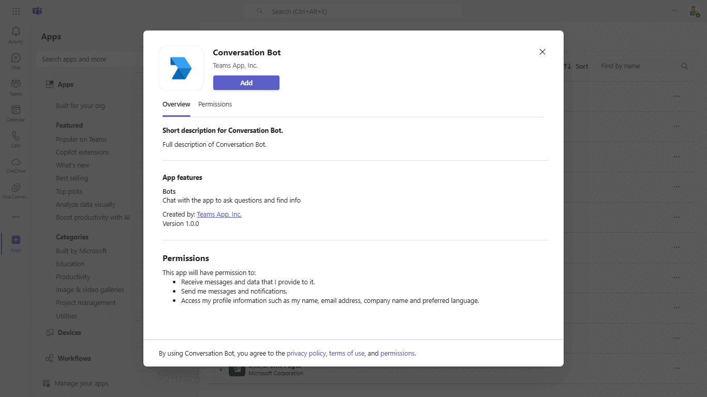
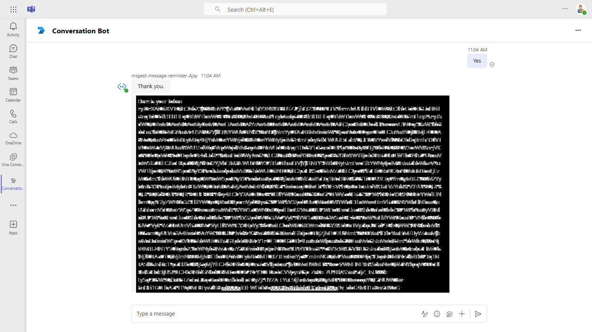

# Teams Conversation Bot SSO quick-start

This sample demonstrates how to integrate Azure AD authentication in Microsoft Teams using a bot with Single Sign-On (SSO) capabilities. Built with the Co-Pilot SDK, it showcases OAuth SSO, Adaptive Cards, and Microsoft Graph API interactions. The sample includes reusable components, like the TeamsActivityHandler, for handling Invoke Activity in Teams. It provides a step-by-step setup guide to authenticate users with identity providers such as Microsoft Entra ID, GitHub, and others.

This bot has been created using [Copilot SDK](https://dev.microsoftcopilot.com), it shows how to get started with SSO in a bot for Microsoft Teams.

The focus of this sample is how to use the Copilot SDK support for OAuth SSO in your bot. Teams behaves slightly differently than other channels in this regard. Specifically an Invoke Activity is sent to the bot rather than the Event Activity used by other channels. _This Invoke Activity must be forwarded to the dialog if the OAuthPrompt is being used._ This is done by subclassing the ActivityHandler and this sample includes a reusable TeamsActivityHandler. This class is a candidate for future inclusion in the Copilot SDK.

The sample uses the bot authentication capabilities in [Azure Bot Service](https://docs.botframework.com), providing features to make it easier to develop a bot that authenticates users to various identity providers such as Microsoft Entra ID, GitHub, Uber, etc. The OAuth token is then used to make basic Microsoft Graph queries.

> IMPORTANT: The manifest file in this app adds "token.botframework.com" to the list of `validDomains`. This must be included in any bot that uses the Copilot SDK OAuth flow.

## Included Features
* Teams SSO (Copilot Bots)
* Adaptive Card
* Graph API

## Interaction with app



## Prerequisites

-  Microsoft Teams is installed and you have an account (not a guest account)
-  [.Net](https://dotnet.microsoft.com/en-us/download/dotnet/6.0) version 6.0
-  [dev tunnel](https://learn.microsoft.com/en-us/azure/developer/dev-tunnels/get-started?tabs=windows) or [ngrok](https://ngrok.com/download) latest version or equivalent tunneling solution
-  [M365 developer account](https://docs.microsoft.com/en-us/microsoftteams/platform/concepts/build-and-test/prepare-your-o365-tenant) or access to a Teams account with the appropriate permissions to install an app.

## Setup

> Note these instructions are for running the sample on your local machine, the tunnelling solution is required because
> the Teams service needs to call into the bot.

1. Setup for Bot SSO

Refer to [Bot SSO Setup document](https://github.com/OfficeDev/Microsoft-Teams-Samples/blob/main/samples/bot-conversation-sso-quickstart/BotSSOSetup.md).

 You can use the `dev tunnels`. Please follow [Create and host a dev tunnel](https://learn.microsoft.com/en-us/azure/developer/dev-tunnels/get-started?tabs=windows) and host the tunnel with anonymous user access command as shown below:

   ```bash
   devtunnel host -p 3978 --allow-anonymous
   ```

2. Setup for code

  - Clone the repository

    ```bash
    git clone https://dynamicscrm@dev.azure.com/dynamicscrm/OneCRM/_git/Microsoft.Agents.Sdk
    ```
  
  - If you are using Visual Studio
    - Launch Visual Studio
    - File -> Open -> Project/Solution
    - Select `Microsoft.CopilotStudio.SDK.sln` file and open it in Visual Studio
    - Navigate to `samples/Teams/bot-conversation-sso-quickstart` folder
    - Set As Startup Project

3. #### Configuring authentication in the Teams Conversation Bot SSO quickstart Sample Project

To configure authentication into the Teams Conversation Bot SSO quickstart Sample Project you will need the following information:

1. Client ID of the Application identity you wish to use.
1. Client Secret of the Application identity you wish to use or the Certificate that has been registered for the Client ID in Entra AD

Once you have that information, to configure authentication, Open the `appsettings.json` file in the root of the sample project.

Find the section labeled `Connections`,  it should appear similar to this:

```json
"Connections": {
  "BotServiceConnection": {
    "Assembly": "Microsoft.Agents.Authentication.Msal",
    "Type":  "MsalAuth",
    "Settings": {
      "AuthType": "ClientSecret", // this is the AuthType for the connection, valid values can be found in Microsoft.Agents.Authentication.Msal.Model.AuthTypes.  The default is ClientSecret.
      "AuthorityEndpoint": "https://login.microsoftonline.com/botframework.com",
      "ClientId": "00000000-0000-0000-0000-000000000000", // this is the Client ID used for the connection.
      "ClientSecret": "00000000-0000-0000-0000-000000000000", // this is the Client Secret used for the connection.
      "Scopes": [
        "https://api.botframework.com/.default"
      ],
      "TenantId": "" // This is the Tenant ID used for the Connection. 
    }
  }
```

1. Set the **AuthType** to either `ClientSecret` or `Certificate`
1. Set the **ClientId** to the Client Id of your identity
1. if you chose `ClientSecret`
    1. Set the ClientSecret to the Secret that was created for your identity.
1. if you chose `Certificate`
    1. Import the PFX Certificate to your local machine and note which certificate store it was loaded into.
    1. Replace the key **ClientSecret** with **CertificateThumbPrint** and set the value of the **CertificateThumbPrint** to the thumbprint of your certificate
1. Set the **TenantId** to the Tenant Id where your application is registered.
1. Set "ConnectionName" in the `appsettings.json`. The Microsoft Entra ID ConnectionName from the OAuth Connection Settings on Azure Bot registration

 - Press `F5` to run the project
    
4.  Manually update the manifest.json
    - Edit the `manifest.json` contained in the  `/appManifest` folder to replace with your MicrosoftAppId (that was created in step1.1 and is the same value of MicrosoftAppId in `appsettings.json` file) *everywhere* you see the place holder string `{TODO: MicrosoftAppId}` (depending on the scenario the Microsoft App Id may occur multiple times in the `manifest.json`). The `ConnectionName` is the name of OAuth Connection you configured in step3.
    - Zip up the contents of the `/appManifest` folder to create a `manifest.zip`
    - Upload the `manifest.zip` to Teams (in the left-bottom *Apps* view, click "Upload a custom app")

**Note**: If you are facing any issue in your app, [please uncomment this line](https://github.com/OfficeDev/Microsoft-Teams-Samples/blob/main/samples/bot-conversation-sso-quickstart/csharp_dotnetcore/BotConversationSsoQuickstart/AdapterWithErrorHandler.cs#L37) and put your debugger for local debug.


## Running the sample




## Further reading

- [Copilot SDK Documentation](https://dev.microsoftcopilot.com)
- [Bot Basics](https://docs.microsoft.com/azure/bot-service/bot-builder-basics?view=azure-bot-service-4.0)
- [Azure Portal](https://portal.azure.com)
- [Microsoft Teams Developer Platform](https://docs.microsoft.com/en-us/microsoftteams/platform/)


