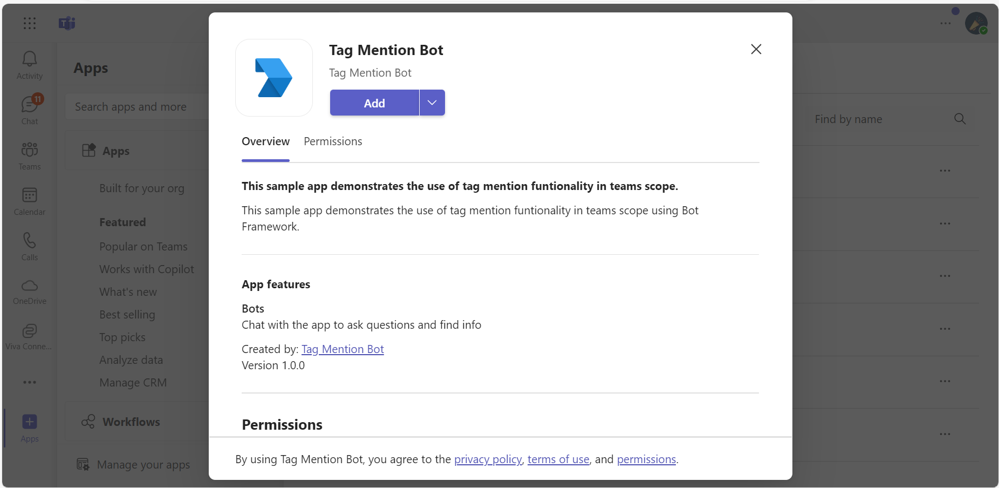
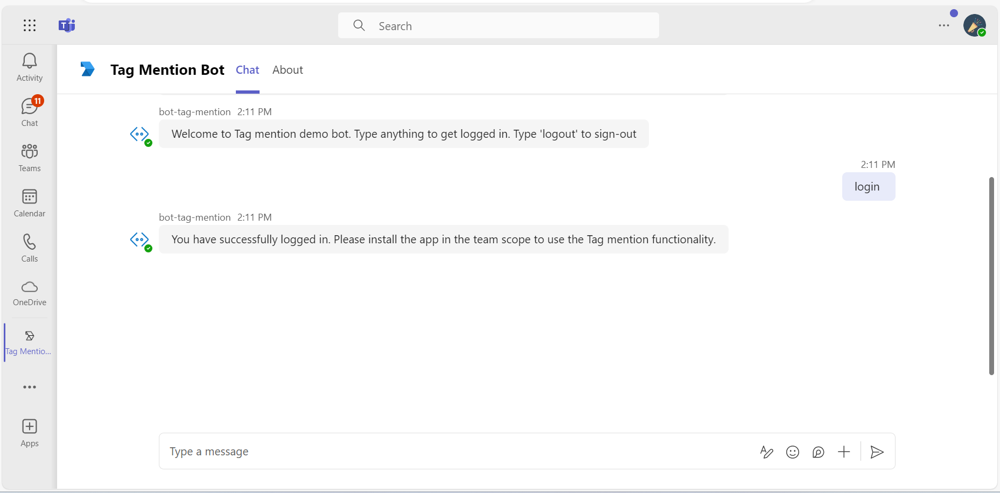
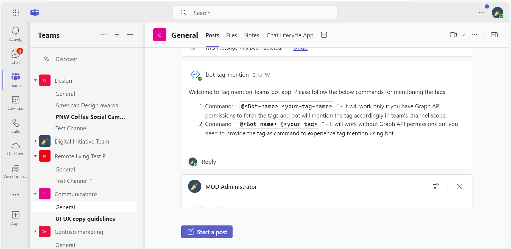
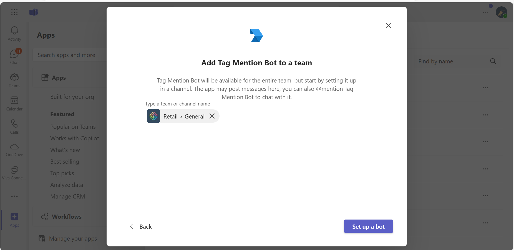
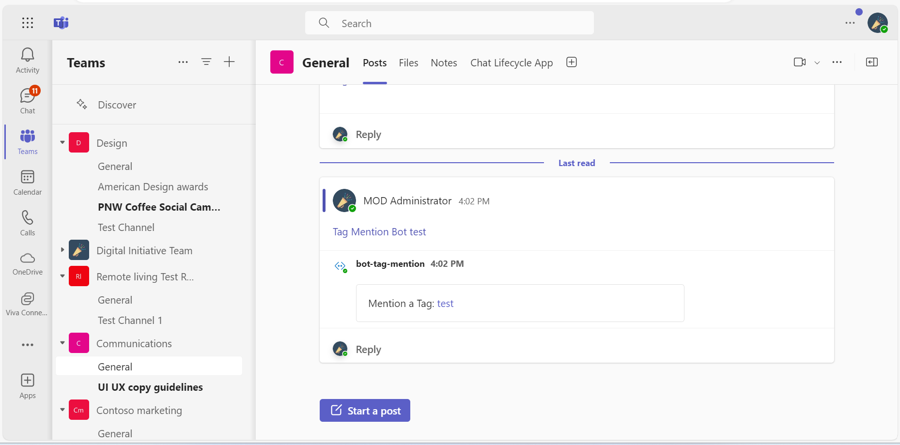
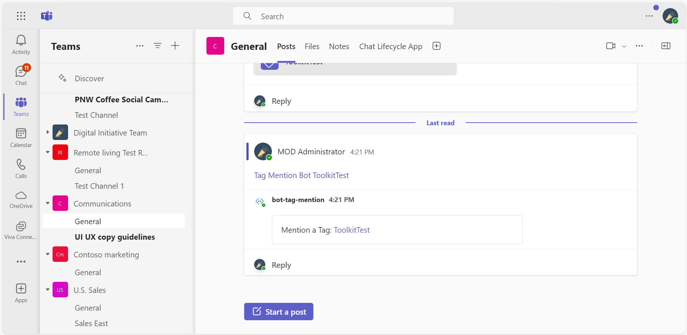
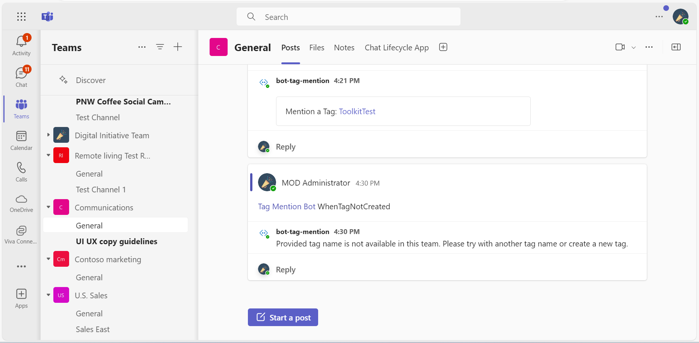

# Tag mention bot

This sample app demonstrates the use of tag mention funtionality in teams scope using Bot Framework.

## Included Features
* Bots
* Adaptive Cards
* Teams Conversation Events

## Interaction with bot


## Prerequisites

- Microsoft Teams is installed and you have an account
- [.NET SDK](https://dotnet.microsoft.com/download) version 6.0
- [dev tunnel](https://learn.microsoft.com/en-us/azure/developer/dev-tunnels/get-started?tabs=windows) or [ngrok](https://ngrok.com/) latest version or equivalent tunnelling solution
- Create tags within the team channel prior to utilizing the bot.
- [Teams](https://teams.microsoft.com/v2/?clientexperience=t2) Microsoft Teams is installed and you have an account
- [Teams Toolkit for Visual Studio](https://learn.microsoft.com/en-us/microsoftteams/platform/toolkit/toolkit-v4/install-teams-toolkit-vs?pivots=visual-studio-v17-7)

## Running this sample

1. [Create an Azure Bot](https://aka.ms/AgentsSDK-CreateBot)
   - Be sure to add the Teams Channel
   - Record the Application ID, the Tenant ID, and the Client Secret for use below
   - Select Configuration section.
   - Under configuration -> Add OAuth connection string.
   - Provide connection Name : for eg `ssoconnection`
   - Select service provider ad `Azure Active Directory V2`
   - Complete the form as follows:
       a. **Name:** Enter a name for the connection. You'll use this name in your bot in the appsettings.json file.
       b. **Client id:** Enter the Application (client) ID that you recorded for your Azure identity provider app in the steps above.
       c. **Client secret:** Enter the secret that you recorded for your Azure identity provider app in the steps above.
       d. **Tenant ID**  Enter value as `common`.
       e. **Token Exchange Url** Enter the url in format `api://<<bot-domain>>/botid-00000000-0000-0000-0000-000000000000`(Refer step 1.5)
       f. Provide **Scopes** like "User.Read openid"

1. Configuring the token connection in the Agent settings
   > The instructions for this sample are for a SingleTenant Azure Bot using ClientSecrets.  The token connection configuration will vary if a different type of Azure Bot was configured.  For more information see [DotNet MSAL Authentication provider](https://aka.ms/AgentsSDK-DotNetMSALAuth)

   1. Open the `appsettings.json` file in the root of the sample project.

   1. Find the section labeled `Connections`,  it should appear similar to this:

      ```json
      "TokenValidation": {
        "Audiences": [
          "00000000-0000-0000-0000-000000000000" // this is the Client ID used for the Azure Bot
        ]
      },

      "Connections": {
          "BotServiceConnection": {
          "Assembly": "Microsoft.Agents.Authentication.Msal",
          "Type":  "MsalAuth",
          "Settings": {
              "AuthType": "ClientSecret", // this is the AuthType for the connection, valid values can be found in Microsoft.Agents.Authentication.Msal.Model.AuthTypes.  The default is ClientSecret.
              "AuthorityEndpoint": "https://login.microsoftonline.com/{{TenantId}}",
              "ClientId": "00000000-0000-0000-0000-000000000000", // this is the Client ID used for the connection.
              "ClientSecret": "00000000-0000-0000-0000-000000000000", // this is the Client Secret used for the connection.
              "Scopes": [
                "https://api.botframework.com/.default"
              ],
              "TenantId": "{{TenantId}}" // This is the Tenant ID used for the Connection. 
          }
      }
      ```

      1. Set the **ClientId** to the AppId of the bot identity.
      1. Set the **ClientSecret** to the Secret that was created for your identity.
      1. Set the **TenantId** to the Tenant Id where your application is registered.
      1. Set the **Audience** to the AppId of the bot identity.
      1. Set the **ConnectionName** to the connection name created earlier under bot Oauth settings.
    
      > Storing sensitive values in appsettings is not recommend.  Follow [AspNet Configuration](https://learn.microsoft.com/en-us/aspnet/core/fundamentals/configuration/?view=aspnetcore-9.0) for best practices.

1. Manually update the manifest.json
   - Edit the `manifest.json` contained in the `/appManifest` folder
     -  Replace with your AppId (that was created above) *everywhere* you see the place holder string `<<AAD_APP_CLIENT_ID>>`
     - Replace `<<BOT_DOMAIN>>` with your Agent url.  For example, the tunnel host name.
   - Zip up the contents of the `/appManifest` folder to create a `manifest.zip`
1. Upload the `manifest.zip` to Teams
   - Select **Developer Portal** in the Teams left sidebar
   - Select **Apps** (top row)
   - Select **Import app**, and select the manifest.zip

1. Run `dev tunnels`. Please follow [Create and host a dev tunnel](https://learn.microsoft.com/en-us/azure/developer/dev-tunnels/get-started?tabs=windows) and host the tunnel with anonymous user access command as shown below:
   > NOTE: Go to your project directory and open the `./Properties/launchSettings.json` file. Check the port number and use that port number in the devtunnel command (instead of 3978).
 
   ```bash
   devtunnel host -p 3978 --allow-anonymous
   ```

1. On the Azure Bot, select **Settings**, then **Configuration**, and update the **Messaging endpoint** to `{tunnel-url}/api/messages`

1. Start the Agent, and select **Preview in Teams** in the upper right corner

## Running the sample

You can interact with this bot in Teams by sending it a message, or selecting a command from the command list. The bot will respond to the following strings.

>Note : Before using the Tag Mention sample in a team channel scope, please install this app in your Personal scope to enable Single Sign-On (SSO) login.

**Personal Scope**
    

1. **SSO Login**
   

**Team channel Scope**

1. **Show Welcome**
  - **Result:** The bot will send the welcome card for you to interact with necessary commands
  - **Valid Scopes:** team chat

   **Show Welcome command interaction:**
  

2. **MentionTag**
  - **Result:** The bot will respond to the message and mention a tag
  - **Valid Scopes:** team chat

  - **Team Scope Interactions:**
     

   **MentionTag command interaction:**
   **Command 1:** `@<Bot-name> <your-tag-name>` - It will work only if you have Graph API permissions to fetch the tags and bot will mention the tag accordingly in team's channel scope.
  

   **Command 2:** `@<Bot-name> @<your-tag>` - It will work without Graph API permissions but you need to provide the tag as command to experience tag mention using bot.
  

   **Hover on the tag to view the details card:**
  

  **Message interaction:**
  When you mention the bot in Teams without providing any commands, you will receive the following message.
  

  If you attempt to use the bot before creating a tag or if you provide an incorrect tag name, you will receive the following message.
  

## Deploy the bot to Azure

To learn more about deploying a bot to Azure, see [Deploy your bot to Azure](https://aka.ms/azuredeployment) for a complete list of deployment instructions.


## Further reading
To learn more about building Bots and Agents, see our [Microsoft 365 Agents SDK](https://github.com/microsoft/agents) repo.