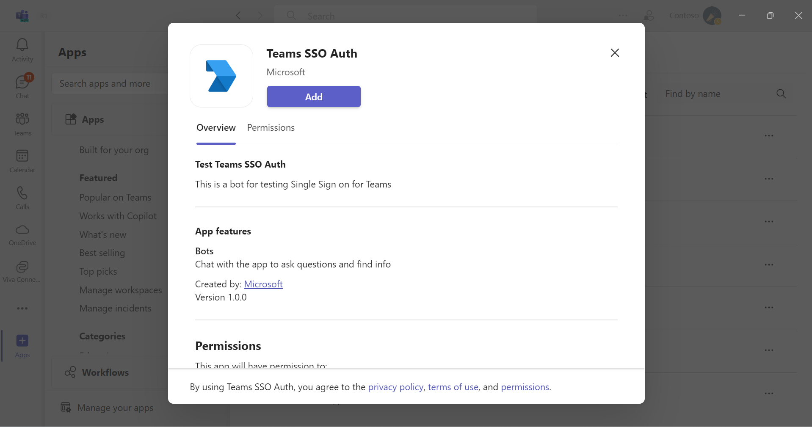
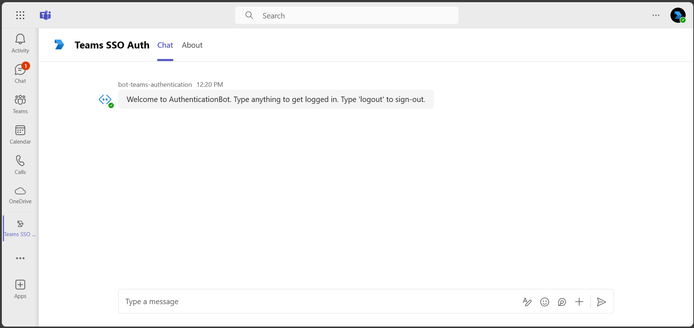
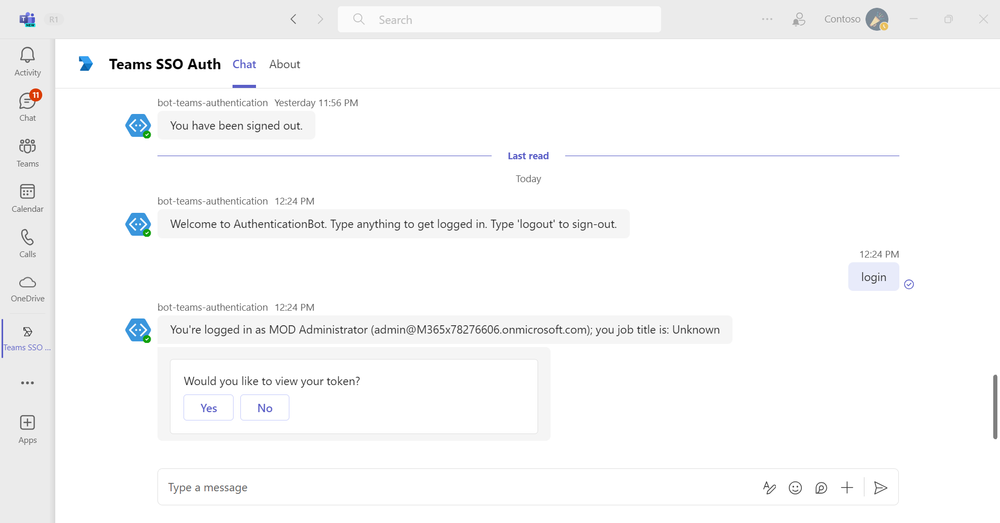
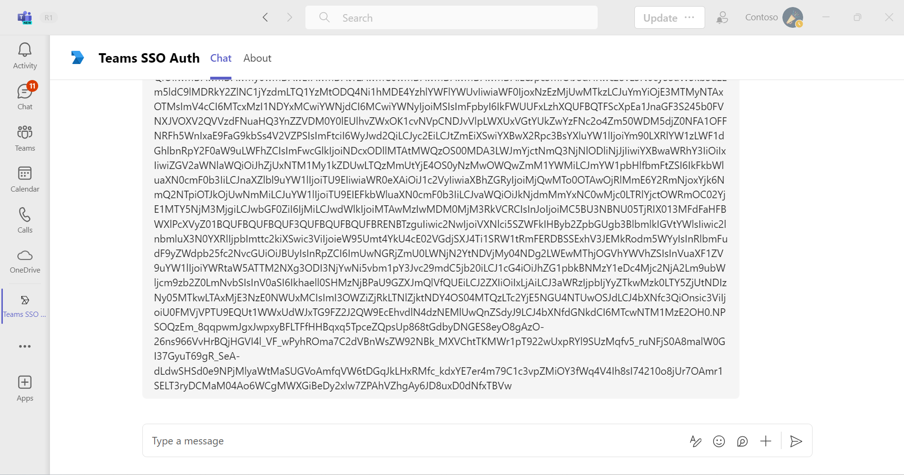
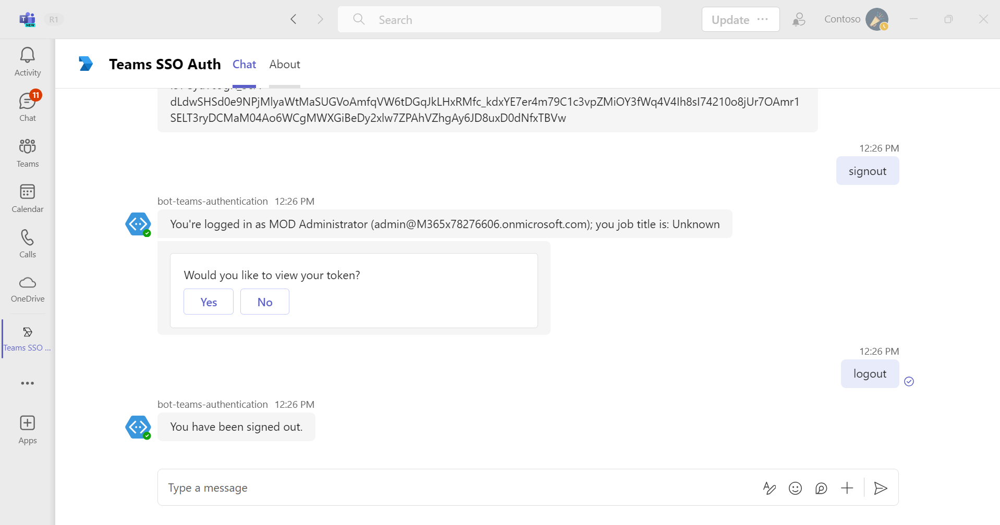

# Teams Auth Bot Copilot Bot C#

This sample demonstrates how to set up user authentication within a Microsoft Teams bot, using the [Copilot SDK](https://dev.microsoftcopilot.com).
It highlights the integration of the Bot Framework's OAuth capabilities, tailored specifically for Teams' unique authentication flow. 
In Teams, an Invoke Activity is sent to the bot for authentication instead of the Event Activity used by other channels, 
which requires forwarding the Invoke Activity to the dialog when using OAuthPrompt. 
This sample includes a customizable TeamsActivityHandler, which extends ActivityHandler to support this flow seamlessly.

Additionally, this bot leverages [Azure Bot Service](https://docs.botframework.com) to authenticate users with identity providers like Microsoft Entra ID, GitHub, and Uber, utilizing OAuth tokens to make Microsoft Graph API calls. 
This offers a practical guide for developers looking to enhance user experiences through authenticated bot interactions in Microsoft Teams.

> IMPORTANT: The manifest file in this app adds "token.botframework.com" to the list of `validDomains`. This must be included in any bot that uses the Bot Framework OAuth flow.

## Single Sign On

This sample utilizes an app setting `UseSingleSignOn` to add `TeamsSSOTokenExchangeMiddleware`. Refer to [Teams SSO](https://docs.microsoft.com/microsoftteams/platform/bots/how-to/authentication/auth-aad-sso-bots) for Microsoft Entra ID and SSO OAuth configuration information.

> IMPORTANT: Teams SSO only works in 1-1 chats, and not group contexts.

This bot has been created using [Copilot SDK](https://dev.microsoftcopilot.com), it shows how to use a bot authentication, as well as how to sign in from a bot. In this sample we are assuming the OAuth 2 provider is Azure Active Directory v2 (AADv2) and are utilizing the Microsoft Graph API to retrieve data about the user. Check [here](https://docs.microsoft.com/azure/bot-service/bot-builder-authentication) for information about getting an AADv2 application setup for use in Azure Bot Service. The scopes used in this sample are the following:

- `openid`
- `User.Read`

## Included Features
* Teams SSO (bots)
* Graph API
* Copilot bots

## Interaction with the bot**


## Prerequisites

- Microsoft Teams is installed and you have an account (not a guest account)
- [.NET SDK](https://dotnet.microsoft.com/download) version 6.0

  ```bash
  # determine dotnet version
  dotnet --version
  ```
- [dev tunnel](https://learn.microsoft.com/en-us/azure/developer/dev-tunnels/get-started?tabs=windows)

## Setup

> Note these instructions are for running the sample on your local machine, the tunnelling solution is required because
> the Teams service needs to call into the bot.

### 1. Setup for Bot Auth
Refer to [Bot SSO Setup document](https://github.com/OfficeDev/Microsoft-Teams-Samples/blob/main/samples/bot-conversation-sso-quickstart/BotSSOSetup.md).

1) Clone the repository

    ```bash
    git clone https://dynamicscrm@dev.azure.com/dynamicscrm/OneCRM/_git/Microsoft.Agents.Sdk
    ```

1) If you are using Visual Studio
- Launch Visual Studio
- Select `Microsoft.CopilotStudio.SDK.sln` file and open it in Visual Studio
- Navigate to `samples/teams/bot-teams-authentication` folder
- Select `TeamsAuth.csproj`.
- Set As Startup Project and Press `F5` to run this project.

1) Run `dev tunnels`. Please follow [Create and host a dev tunnel](https://learn.microsoft.com/en-us/azure/developer/dev-tunnels/get-started?tabs=windows) and host the tunnel with anonymous user access command as shown below:
   > NOTE: Go to your project directory and open the `./Properties/launchSettings.json` file. Check the port number and update it to match your DevTunnel port. If `./Properties/launchSettings.json`not fount Close and re-open the solution.launchSettings.json have been re-created.

   ```bash
   devtunnel host -p 3978 --allow-anonymous
   ```

#### Configuring authentication in the Teams Auth Sample Project

To configure authentication into the Teams Auth Sample Project you will need the following information:

1. Client ID of the Application identity you wish to use.
1. Client Secret of the Application identity you wish to use or the Certificate that has been registered for the Client ID in Entra AD

Once you have that information, to configure authentication, Open the `appsettings.json` file in the root of the sample project.

Find the section labeled `Connections`,  it should appear similar to this:

```json
"Connections": {
  "BotServiceConnection": {
    "Assembly": "Microsoft.Agents.Authentication.Msal",
    "Type":  "MsalAuth",
    "Settings": {
      "AuthType": "ClientSecret", // this is the AuthType for the connection, valid values can be found in Microsoft.Agents.Authentication.Msal.Model.AuthTypes.  The default is ClientSecret.
      "AuthorityEndpoint": "https://login.microsoftonline.com/botframework.com",
      "ClientId": "00000000-0000-0000-0000-000000000000", // this is the Client ID used for the connection.
      "ClientSecret": "00000000-0000-0000-0000-000000000000", // this is the Client Secret used for the connection.
      "Scopes": [
        "https://api.botframework.com/.default"
      ],
      "TenantId": "" // This is the Tenant ID used for the Connection. 
    }
  }
```

1. Set the **AuthType** to either `ClientSecret` or `Certificate`
1. Set the **ClientId** to the Client Id of your identity
1. if you chose `ClientSecret`
    1. Set the ClientSecret to the Secret that was created for your identity.
1. if you chose `Certificate`
    1. Import the PFX Certificate to your local machine and note which certificate store it was loaded into.
    1. Replace the key **ClientSecret** with **CertificateThumbPrint** and set the value of the **CertificateThumbPrint** to the thumbprint of your certificate
1. Set the **TenantId** to the Tenant Id where your application is registered.
1. Set "ConnectionName" in the `appsettings.json`. The Microsoft Entra ID ConnectionName from the OAuth Connection Settings on Azure Bot registration

1) Run your bot, either from Visual Studio with `F5` or using `dotnet run` in the appropriate folder.

1) __*This step is specific to Teams.*__
    - **Edit** the `manifest.json` contained in the `appManifest` folder to replace your Microsoft App Id(Client ID) (that was created when you registered your bot earlier) *everywhere* you see the place holder string `<<APP_ID>>` (depending on the scenario the MicrosoftAppId may occur multiple times in the `manifest.json`)
    - **Edit** the `manifest.json` for `validDomains` with base Url domain. E.g. if you are using dev tunnels then your domain will be like: `12345.devtunnels.ms`.
    - **Zip** up the contents of the `appManifest` folder to create a `manifest.zip` (Make sure that zip file does not contains any subfolder otherwise you will get error while uploading your .zip package)
    - **Upload** the `manifest.zip` to Teams (In Teams Apps/Manage your apps click "Upload an app". Browse to and Open the .zip file. At the next dialog, click the Add button.)
    - Add the app to personal scope or 1:1 chat (Supported scope)
    
## Running the sample

> Note `manifest.json` contains a `webApplicationInfo` template required for Teams Single Sign On.

You can interact with this bot by sending it a message. The bot will respond by requesting you to login to Microsoft Entra ID, then making a call to the Graph API on your behalf and returning the results.











## Deploy the bot to Azure

To learn more about deploying a bot to Azure, see [Deploy your bot to Azure](https://aka.ms/azuredeployment) for a complete list of deployment instructions.

## Further reading

- [Copilot SDK](https://dev.microsoftcopilot.com)
- [Bot Basics](https://docs.microsoft.com/azure/bot-service/bot-builder-basics?view=azure-bot-service-4.0)
- [Azure Bot Service Introduction](https://docs.microsoft.com/azure/bot-service/bot-service-overview-introduction?view=azure-bot-service-4.0)
- [Azure Bot Service Documentation](https://docs.microsoft.com/azure/bot-service/?view=azure-bot-service-4.0)
- [Bot Authentication Basics](https://learn.microsoft.com/en-us/microsoftteams/platform/bots/how-to/authentication/bot-sso-overview)

